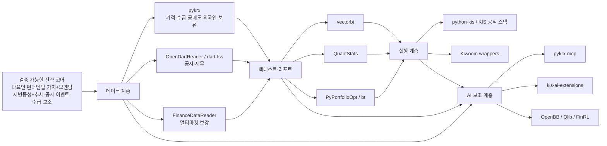
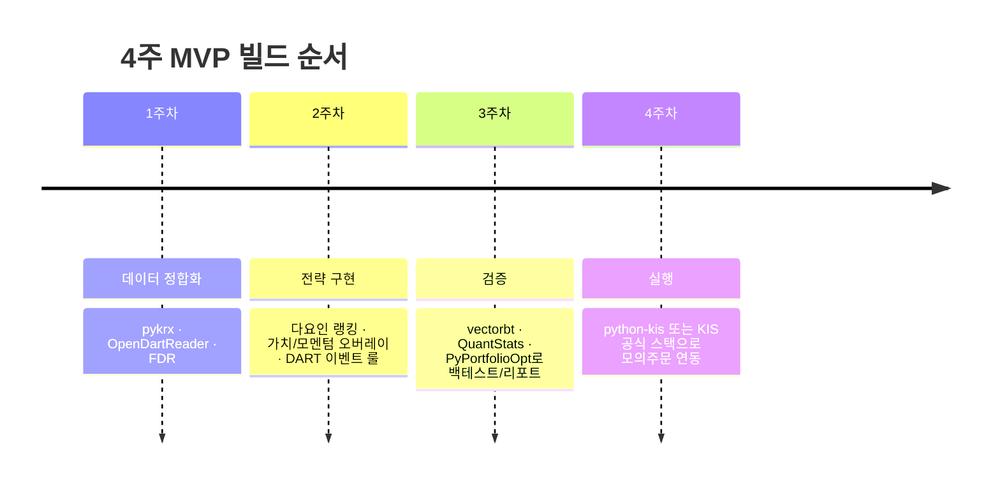

# 인기 있는 GitHub·오픈소스·AI Skill 기반 국내 주식 투자기법 구현 자산 심층조사

## Executive Summary

이번 조사에서 가장 먼저 드러난 결론은, **국내 주식에서 “그대로 가져다 쓸 수 있는” 공개 자산의 중심은 유명 투자기법 자체보다 데이터·백테스트·브로커 실행 계층**에 있다는 점입니다. 특히 한국투자증권 공식 `koreainvestment/open-trading-api`는 `examples_llm`, `examples_user`, `strategy_builder`, `backtester`를 한 저장소에 묶어 두었고, 2026년 3월까지 활동이 이어졌습니다. 데이터 측면에서는 `pykrx`, `FinanceDataReader`, `OpenDartReader`가 한국 시장 MVP의 핵심 축으로 보였고, 실행 계층에서는 `python-kis`가 가장 현실적인 Python 래퍼였습니다. 백테스트·리포트 계층에서는 `vectorbt`, `QuantStats`, `PyPortfolioOpt`가 재사용성이 가장 높았습니다. citeturn11view0turn14view0turn24search24turn25search9turn2view3turn4view0turn10search1turn12view1turn15view0turn18view0turn19view0turn21view0turn18view4turn19view3turn22view2turn18view3turn19view2turn22view1

전략 자체로 보면, **한국 시장에서 단일 “비법”의 신뢰도는 낮고, 다요인 기반의 설명 가능한 조합형 전략이 더 방어적**입니다. 한국 시장 148개 이상현상을 복제한 연구는 엄격한 통계 기준에서 살아남는 비율이 높지 않다고 보고했고, 순수 단기 모멘텀은 한국에서 부정적이거나 불안정하다는 결과도 있습니다. 반면 한국 시장의 PEAD, 52주 고점 기준의 공시 후 저반응, 투자자군별 매매행태, 외국인 공매도의 예측력 같은 **이벤트·수급 계열 보조 신호**는 상대적으로 실증 근거가 더 분명합니다. 따라서 “가장 괜찮은” 전략은 **다요인 펀더멘털 코어 + 가치·모멘텀 오버레이 + 저변동성·추세 리스크 필터 + 공시 이벤트·수급 보조 신호**의 구조로 보는 것이 합리적입니다. citeturn35search0turn34search2turn34search8turn34search16turn34search25turn34search3turn34search11turn34search15turn35search8

또 하나 중요한 결론은, **인기 있는 GitHub 저장소라고 해서 곧바로 상업적 재사용이 가능한 것은 아니라는 점**입니다. 예를 들어 `vectorbt`는 Apache 2.0 기반이지만 Commons Clause가 붙어 있고, `backtrader`는 GPL-3.0, `OpenBB`는 AGPLv3입니다. 반대로 일부 국내 유망 저장소는 GitHub UI 기준 명시적 라이선스 확인이 어려워, “공개되어 있으니 그냥 복붙해도 된다”는 접근이 가장 위험합니다. 이 문제는 기술성보다 먼저 확인해야 할 도입 관문입니다. citeturn23view0turn39view0turn23view3turn31view0

빠른 MVP를 목표로 하면, **첫 번째 추천 조합은 `pykrx + OpenDartReader + vectorbt + QuantStats + python-kis`**, **두 번째 추천 조합은 한국투자증권을 전제로 `open-trading-api + pykrx + OpenDartReader`**, **세 번째 추천 조합은 추천·리서치 보조형으로 `FinanceDataReader + pykrx + OpenDartReader + PyPortfolioOpt + pykrx-mcp`**입니다. 반대로 `Qlib`, `FinRL`, `OpenBB`는 인기와 기술성은 높지만, 한국 시장용 첫 MVP 관점에서는 데이터 현지화 비용이 커서 **초기 핵심 엔진**보다 **후속 확장층**에 가깝습니다. citeturn18view5turn19view4turn22view3turn18view6turn19view5turn22view4turn18view7turn19view6turn22view5

## 조사 프레임과 전략 검증 기준

이번 평가는 **최근 5년 내 활동 자산을 우선**했고, 자산을 아래 7개 범주로 나누어 보았습니다.

| 범주 | 의미 | 이번 조사에서의 판단 포인트 |
|---|---|---|
| A | 전략 구현 저장소 | 실제 스크리닝·랭킹·룰 기반 매매 로직이 있는가 |
| B | 데이터 파이프라인 | 한국 주가·재무·공시·수급 데이터를 안정적으로 가져오는가 |
| C | 브로커 API 래퍼 | 주문·잔고·실시간 데이터 연동이 쉬운가 |
| D | 백테스트·성과분석 | 전략 검증, 리포트, 파라미터 탐색이 가능한가 |
| E | AI Skill·MCP·Agent | 바이브코딩/에이전트 UX를 얼마나 가속하는가 |
| F | 완성형 추천·리서치 플랫폼 | 대시보드·워크스페이스·엔드투엔드 경험이 있는가 |
| G | 국내 커뮤니티 회자/학습형 구현 | 한국 투자 커뮤니티에서 참조 가치가 있는가 |

정량 평가는 **인기·기술성·전략타당성·국내적합성·재사용성** 5개 축 각 1~5점, 총 25점으로 잡았습니다. 다만 이 점수는 절대평가가 아니라, **“빠른 MVP 제작”이라는 목적에 맞춘 실무 점수**입니다. 예를 들어 `FinRL`과 `Qlib`는 기술성은 높지만, 한국 현지 데이터·브로커 연결 비용 때문에 초기 MVP 점수가 낮아졌습니다. 반대로 `pykrx`, `OpenDartReader`, `python-kis`는 인기 면에서 글로벌 퀀트 프레임워크보다 약해도, 한국 적용성과 재사용성 때문에 높은 점수를 받았습니다. citeturn25search9turn32view0turn10search1turn18view5turn18view6

전략 검증 기준은 사용자가 지정한 5개 유망 전략을 그대로 쓰되, **한국 시장에서 독립 전략으로 검증되었는지**와 **MVP에 넣기 좋은 구현 형태인지**를 분리해서 판단했습니다.

| 전략 | 한국 시장 실증 판정 | 실무적 해석 |
|---|---|---|
| 다요인 펀더멘털 | **추천**. 한국 시장의 단일 이상현상 다수는 엄격 기준에서 약화되지만, factor investing 자체는 제도권에서 널리 쓰이는 프레임이며 단일 “마법 공식”보다 방어적입니다. citeturn35search0turn34search2 | 가치·퀄리티·수익성·규모·유동성 필터의 조합형 랭킹이 현실적입니다. |
| 가치+모멘텀 | **조건부 추천**. 한국에서 순수 단기 모멘텀은 부정적이거나 불안정하다는 결과가 있으나, 상대/수렴형 모멘텀과 실무 인덱스 적용은 분명 존재합니다. citeturn34search8turn34search16turn35search17 | 가격 모멘텀을 단독으로 쓰지 말고, 가치·퀄리티 랭킹의 보조 신호로 넣는 편이 낫습니다. |
| 저변동성+추세 | **조건부 추천**. KOSDAQ에서 저변동성 효과를 지지하는 연구는 있으나, “저변동성+추세” 조합 자체가 한국 시장에서 단일 정설로 검증됐다고 말하기는 어렵습니다. 다만 두 축을 결합한 리스크 필터로는 타당합니다. citeturn34search25turn34search13 | 종목 선택 알파보다 **포트폴리오 리스크 관리 레이어**로 넣는 것이 낫습니다. |
| 공시 이벤트 | **강한 보조 알파**. 한국에서 PEAD와 공시 후 저반응이 보고되며, 52주 고점 anchor와 개인투자자 역행매매가 설명 변수로 제시됩니다. citeturn34search3turn34search11turn34search15 | DART 파싱 기반 이벤트 스코어는 MVP에 넣을 가치가 큽니다. |
| 수급 보조 | **보조 신호로 유효**. 외국인 공매도는 미래 수익률 하락과 연결되고, 투자자군별 거래행태는 PEAD 해석에도 중요합니다. citeturn35search8turn34search3turn34search15 | 독립 전략보다 **확인 신호**로 쓰는 것이 안전합니다. |

한국 시장 데이터 원천은 가능하면 **KRX Market Data System과 DART를 기준 소스**로 삼는 편이 맞습니다. 또한 한국 시장은 2025년 3월 31일 공매도 재개와 제도 개편을 거쳤기 때문에, 공매도·수급·미시구조가 섞인 전략은 **금지 기간 이전과 이후를 분리 검증**해야 합니다. 이 점은 과거 백테스트를 그대로 믿지 말아야 하는 가장 큰 이유 중 하나입니다. citeturn34search9turn8search19turn35search5turn35search20

## 생태계 지도와 핵심 발견

국내 주식 오픈소스의 구조는 아래처럼 보는 것이 가장 정확합니다. **전략 엔진보다 데이터·검증·실행 인프라가 강하고, AI Skill 계층은 빠르게 늘고 있지만 아직 성숙도 편차가 큽니다.** citeturn24search24turn10search4turn24search27turn25search9turn32view0turn18view0turn18view4turn10search1

첫째, **국내에서 가장 강한 “한 방” 저장소는 공식 한국투자증권 스택**입니다. `koreainvestment/open-trading-api`는 전략 설계·백테스트·주문 실행을 한 레포 안에서 이어주고, KIS Developers 포털도 ChatGPT·Claude 연동과 GitHub 샘플 코드 활용을 전면에 내세우고 있습니다. KIS 계좌를 전제로 한다면, 현재 공개 자산 중 국내 자동매매 MVP와 가장 가까운 출발점입니다. citeturn11view0turn14view0turn24search24turn10search4turn24search27

둘째, **데이터 계층은 `pykrx + OpenDartReader`가 사실상 표준 조합**입니다. `pykrx`는 한국 시장 가격·기초지표·수급·공매도·외국인 보유 등 국내 전략에 꼭 필요한 필드를 넓게 제공하고, `OpenDartReader`는 DART 이벤트·재무 계층을 가볍게 붙일 수 있습니다. `FinanceDataReader`는 국내 전용 심도는 `pykrx`보다 옅지만, 멀티마켓 비교와 빠른 프로토타이핑에서는 여전히 강합니다. citeturn25search9turn32view0turn2view2turn7view0turn2view3turn4view0

셋째, **키움계열은 여전히 실전성은 있으나 클라우드·에이전트 친화성은 떨어집니다.** `breadum/kiwoom`은 최근 2025년까지 업데이트되었지만 PyQt 기반 단순 래퍼이고, `KOAPY` 문서는 Windows 10 64비트와 32비트 제약을 전제로 설명합니다. 즉, 키움 계좌가 이미 있고 데스크톱 환경이 고정되어 있다면 쓸 수 있지만, **바이브코딩 기반의 빠른 웹/클라우드 MVP**라는 목적에는 KIS REST 진영이 더 자연스럽습니다. citeturn11view4turn12view4turn15view3turn11view2turn10search5turn15view1

넷째, **AI Skill/MCP 층은 2025~2026년에 급격히 늘었지만 아직 “보조 계층”에 머무는 경우가 많습니다.** `kis-ai-extensions`는 자연어 기반 전략 설계→백테스트→주문 파이프라인이라는 아이디어가 매우 좋고, `pykrx-mcp`는 한국 주식 데이터 23개 도구를 이미 대화형으로 제공합니다. 다만 이들은 아직 핵심 알파 엔진이라기보다 **UX 가속기**에 가깝습니다. 반대로 `Qlib`, `FinRL`, `OpenBB`는 인기는 높지만 한국 시장 맞춤 작업량이 커서, 첫 MVP의 중심보다 **2단계 확장 후보**로 보는 편이 안전합니다. citeturn26view0turn29view0turn32view0turn33view0turn18view5turn22view3turn18view6turn22view4turn18view7turn22view5

국내 커뮤니티 참조용으로는 `hyunyulhenry/quant_py`가 가장 의미가 컸습니다. 책·유튜브와 연결되어 있고, 종목선정·포트폴리오 구성·백테스트·증권사 API 연결까지 폭넓게 담고 있어 **“실무자가 아이디어를 빨리 훑는 용도”**로는 좋습니다. 다만 코드베이스와 라이선스, 장기 유지보수 관점에서는 생산용 핵심 엔진이 아니라 참고 구현으로 보는 편이 맞습니다. 반대로 `tomowind/hkkang_youtube`는 강환국식 전략 구현 아카이브라는 점에서 흥미롭지만, 마지막 커밋이 2019년으로 너무 오래되어 직접 도입 자산으로 보기는 어렵습니다. citeturn9view1turn36view0turn37view0turn9view2turn36view1turn38view0

## Top20 자산 평가표

아래 표는 **MVP 제작 관점**에서 정렬한 Top 20입니다.  
권고 등급은 **① 바로 도입, ② 핵심 후보, ③ 선택 도입, ④ 참조용, ⑤ 보류**를 뜻합니다.

| 순위 | 분류 | 저장소 | Star | 최근 커밋 | 라이선스 | 한국 적용성 | 점수 인/기술/전략/국내/재 | 총점 | 권고 |
|---:|---|---|---:|---|---|---|---|---:|---:|
| 1 | A/C/D/E | `koreainvestment/open-trading-api` citeturn11view0turn12view0turn14view0turn24search24 | 1.4k | 2026-03-18 | 명시 확인 필요 | 매우 높음 | 4/4/4/5/5 | 22 | ① |
| 2 | B | `sharebook-kr/pykrx` citeturn25search9turn33view0 | 1.6k | 2025-07-07 | MIT | 매우 높음 | 4/4/4/5/5 | 22 | ① |
| 3 | D | `polakowo/vectorbt` citeturn18view0turn19view0turn21view0turn23view0 | 7.6k | 2026-04-23 | Apache 2.0 with Commons Clause | 중간 | 5/5/4/3/4 | 21 | ① |
| 4 | B | `FinanceDataReader/FinanceDataReader` citeturn2view3turn4view0 | 3.5k | 2026-05-10 | MIT | 높음 | 4/4/3/5/5 | 21 | ① |
| 5 | B | `FinanceData/OpenDartReader` citeturn5view2turn7view0 | 618 | 2026-04-24 | MIT | 매우 높음 | 3/4/4/5/5 | 21 | ① |
| 6 | C | `Soju06/python-kis` citeturn11view1turn12view1turn15view0 | 275 | 2025-10-13 | MIT | 매우 높음 | 3/4/3/5/5 | 20 | ① |
| 7 | D | `ranaroussi/quantstats` citeturn18view4turn19view3turn22view2 | 7.1k | 2026-01-13 | Apache-2.0 | 중간 | 5/4/3/3/5 | 20 | ② |
| 8 | D | `PyPortfolio/PyPortfolioOpt` citeturn18view3turn19view2turn22view1 | 5.7k | 2026-03-10 | MIT | 중간 | 5/4/4/3/4 | 20 | ② |
| 9 | E | `koreainvestment/kis-ai-extensions` citeturn26view0turn27view0turn29view0turn31view0 | 174 | 2026-03-31 | 명시 확인 필요 | 높음 | 2/4/4/5/3 | 18 | ② |
| 10 | B | `josw123/dart-fss` citeturn5view1turn7view1 | 270 | 2024-08-07 | MIT | 높음 | 2/3/4/5/4 | 18 | ② |
| 11 | D | `pmorissette/bt` citeturn18view2turn19view1turn22view0 | 2.9k | 2026-05-05 | MIT | 중간 | 4/4/3/3/4 | 18 | ② |
| 12 | A/D/F | `microsoft/qlib` citeturn18view5turn19view4turn22view3turn23view1 | 43.2k | 2026-04-22 | MIT | 낮음 | 5/5/4/2/2 | 18 | ③ |
| 13 | C | `breadum/kiwoom` citeturn11view4turn12view4turn15view3 | 181 | 2025-09-14 | MIT | 중상 | 3/4/3/4/3 | 17 | ③ |
| 14 | F/E | `OpenBB-finance/OpenBB` citeturn18view7turn19view6turn22view5turn23view3 | 67.7k | 2026-05-11 | AGPLv3 | 낮음~중간 | 5/5/2/2/3 | 17 | ③ |
| 15 | E | `sharebook-kr/pykrx-mcp` citeturn32view0turn33view0 | 3 | 2026-02-01 | MIT | 높음 | 1/3/3/5/4 | 16 | ③ |
| 16 | C | `sharebook-kr/mojito` citeturn11view3turn12view3turn15view2 | 90 | 2024-02-20 | MIT | 높음 | 2/3/3/4/4 | 16 | ③ |
| 17 | D | `mementum/backtrader` citeturn39view0turn40view0 | 21.6k | 2023-04-19 | GPL-3.0 | 중하 | 5/4/3/2/2 | 16 | ④ |
| 18 | G/A | `hyunyulhenry/quant_py` citeturn9view1turn36view0turn37view0 | 261 | 2024-05-14 | 표기 확인 필요 | 중상 | 3/3/3/4/3 | 16 | ③ |
| 19 | C | `elbakramer/koapy` citeturn11view2turn12view2turn15view1turn10search5 | 222 | 2022-12-16 | MIT/Apache/GPL 선택형 | 중간 | 3/4/3/3/2 | 15 | ④ |
| 20 | A/D/F | `AI4Finance-Foundation/FinRL` citeturn18view6turn19view5turn22view4turn23view2turn17search6 | 15.2k | 2026-04-05 | MIT | 낮음 | 5/4/2/1/2 | 14 | ④ |

Top 20 밖의 **관찰 가치가 높은 watchlist**로는 `koreainvestment/koreainvestment-mcp`, `financial-datasets/mcp-server`, `ferdousbhai/investor-agent`, `marketcalls/vectorbt-backtesting-skills`, `tomowind/hkkang_youtube`가 있습니다. 다만 이들은 각각 **검색 전용 보조 성격**, **한국 비적합성**, **미국 장기투자 중심**, **한국 데이터 부재**, **활동 정체** 때문에 상위 20의 우선순위를 넘지 못했습니다. citeturn26view1turn30view0turn26view2turn30view1turn26view3turn30view3turn26view4turn30view2turn9view2turn38view0

## 당장 가져다 쓸 Top10과 전략 매칭

먼저, 실제로 **지금 당장 들고 와서 MVP에 넣기 좋은 10개**를 A/B/C로 나누면 아래처럼 정리됩니다.

| 분류 | 의미 | 자산 |
|---|---|---|
| A | 그대로 도입 가능 | `pykrx`, `OpenDartReader`, `python-kis`, `koreainvestment/open-trading-api` |
| B | 부분 재사용 후 핵심 채택 | `FinanceDataReader`, `vectorbt`, `QuantStats`, `PyPortfolioOpt` |
| C | 보완 후 사용 | `koreainvestment/kis-ai-extensions`, `breadum/kiwoom` |

같은 10개를 사용자가 요청한 평가 템플릿에 맞춰 압축하면 아래와 같습니다.

| 저장소 | 기본정보 | 기능 | 연결 전략 | 문서성·실전활용성 | 검증수준·국내적합성 | 라이선스·도입결론 |
|---|---|---|---|---|---|---|
| `sharebook-kr/pykrx` citeturn25search9turn33view0 | 1.6k stars, 2025-07-07, MIT | 가격·수급·공매도·외국인 보유까지 한국 시장 핵심 필드 제공 | 다요인 펀더멘털, 가치+모멘텀, 수급 보조 | 문서와 사용 예가 충분하고, 데이터 레이어 재사용성이 가장 높음 | 한국 적합성 최상. 공식 원천은 아니지만 KRX/Naver 기반으로 실무성이 높음 | **MVP 필수 채택** |
| `FinanceData/OpenDartReader` citeturn5view2turn7view0 | 618 stars, 2026-04-24, MIT | DART 공시·재무 조회를 가볍게 붙일 수 있음 | 공시 이벤트, 다요인 펀더멘털 | README가 단순하고 Python에서 바로 붙이기 쉬움 | 한국 공시 이벤트 구현의 가장 쉬운 출발점 | **MVP 필수 채택** |
| `Soju06/python-kis` citeturn11view1turn12view1turn15view0 | 275 stars, 2025-10-13, MIT | 타입힌트, 영문 네이밍, 복구 가능한 웹소켓 제공 | 자동매매 실행, 실시간 가격·호가 | 커뮤니티 래퍼 중 문서성과 개발경험이 가장 좋음 | KIS 계좌 전제일 때 국내 실전성 높음 | **실행 계층의 1순위** |
| `koreainvestment/open-trading-api` citeturn11view0turn14view0turn24search24 | 1.4k stars, 2026-03-18, 공식 저장소 | LLM 예제, 사용자 예제, 전략빌더, 백테스터, MCP 주제 포함 | 가치+모멘텀, 추세형 룰, 제한적 자동매매 | 공식 샘플답게 진입장벽이 낮음 | KIS 전용이라는 제약이 있지만 국내 MVP 근접도 최고 | **KIS 전용 MVP의 최단 경로** |
| `FinanceDataReader/FinanceDataReader` citeturn2view3turn4view0 | 3.5k stars, 2026-05-10, MIT | 멀티마켓 가격 데이터와 빠른 프로토타이핑 | 가치+모멘텀, 저변동성+추세 | 문서 및 커뮤니티 레퍼런스가 풍부함 | 한국전용 심도는 `pykrx`보다 낮지만 보조 레이어로 우수 | **보조 데이터 레이어로 채택** |
| `polakowo/vectorbt` citeturn18view0turn19view0turn21view0turn23view0 | 7.6k stars, 2026-04-23, Apache 2.0 with Commons Clause | 대규모 파라미터 탐색, 벡터화 백테스트, 리포트 | 가치+모멘텀, 저변동성+추세, 수급 필터 최적화 | 문서성 우수, 실험 속도 매우 빠름 | 학술 검증 자체를 제공하진 않지만 검증 도구로 최고 수준 | **연구·검증 엔진 1순위** |
| `ranaroussi/quantstats` citeturn18view4turn19view3turn22view2 | 7.1k stars, 2026-01-13, Apache-2.0 | 성과보고서, 리스크 메트릭, tear sheet | 모든 전략의 성과 평가 | 도입이 매우 쉽고 결과 설명력이 좋음 | 한국 데이터 여부와 무관하게 평가층에서 유효 | **성과 리포트 표준** |
| `PyPortfolio/PyPortfolioOpt` citeturn18view3turn19view2turn22view1 | 5.7k stars, 2026-03-10, MIT | 효율적 프런티어, Black-Litterman, HRP | 다요인 펀더멘털 포트폴리오화, 저변동성+추세 조합 | 문서 우수, 포트폴리오 단계에서 강함 | 종목추천 엔진보다 포트폴리오 구성 레이어로 적합 | **후행 포트폴리오 최적화에 채택** |
| `koreainvestment/kis-ai-extensions` citeturn26view0turn27view0turn29view0turn31view0 | 174 stars, 2026-03-31, 라이선스 확인 필요 | 자연어 전략 설계, Lean 기반 백테스트, 주문 확인 훅 | 규칙 기반 전략 테스트, AI 코파일럿 UX | 아이디어는 매우 좋고 최신성이 있음 | KIS 한정이며 아직 성숙도는 낮음 | **핵심 엔진이 아니라 보조 UX 층으로 채택** |
| `breadum/kiwoom` citeturn11view4turn12view4turn15view3 | 181 stars, 2025-09-14, MIT | PyQt 기반 단순 키움 OpenAPI+ 래퍼 | 자동매매 실행 | 단순하고 바로 쓰기 쉽지만 데스크톱 제약이 큼 | 키움 계좌 보유자에겐 유효, 클라우드형 MVP엔 덜 적합 | **키움 사용 시 선택 채택** |

사용자가 지정한 유망 전략과 공개 자산을 매칭하면 아래 구성이 가장 실전적입니다.

| 전략 | 가장 잘 맞는 핵심 자산 | 구현 방식 | 판단 |
|---|---|---|---|
| 다요인 펀더멘털 | `pykrx` + `OpenDartReader` + `vectorbt` + `PyPortfolioOpt` citeturn25search9turn33view0turn5view2turn7view0turn18view0turn18view3turn35search0turn34search2 | PER/PBR/EV계열 + 수익성/품질 + 유동성 필터 후 랭킹, 이후 포트폴리오 최적화 | **가장 추천** |
| 가치+모멘텀 | `pykrx` + `FinanceDataReader` + `vectorbt` + `QuantStats` + `quant_py` 참조 citeturn25search9turn2view3turn18view0turn18view4turn9view1turn34search8turn34search16 | 가치 랭킹에 상대 모멘텀을 보조 신호로 결합 | **조건부 추천** |
| 저변동성+추세 | `FinanceDataReader` 또는 `pykrx` + `vectorbt` + `PyPortfolioOpt` + `QuantStats` citeturn2view3turn25search9turn18view0turn18view3turn18view4turn34search25 | 종목 알파보다 포트폴리오 리스크 필터·체 regime 필터 | **추천하되 추론임을 명시** |
| 공시 이벤트 | `OpenDartReader` 또는 `dart-fss` + `pykrx` + `vectorbt` citeturn5view2turn7view0turn5view1turn7view1turn25search9turn34search3turn34search11turn34search15 | 실적공시·정정공시·특정 이벤트 후 보유기간 룰 테스트 | **강한 보조 전략** |
| 수급 보조 | `pykrx` + `python-kis` 또는 `open-trading-api` citeturn25search9turn10search1turn11view0turn35search8 | 순매수·외국인 보유·공매도 비중을 진입/제외 필터로 사용 | **보조 신호로 채택** |

핵심만 요약하면, **가장 좋은 투자기법은 “다요인 펀더멘털”을 중심에 두고, 가치+모멘텀을 랭킹 강화용으로 얹고, 저변동성+추세를 리스크 필터로, 공시·수급을 이벤트 확인용으로 붙이는 조합**입니다. 한국 시장에서는 이를 대체할 만큼 강하게 검증된 단일 비법형 공개 전략을 찾지 못했습니다. citeturn35search0turn34search2turn34search8turn34search25turn34search3turn35search8

## MVP 조합과 리스크 체크리스트

실제 개발을 시작할 때 쓸 만한 조합은 세 가지입니다.

| 조합 | 구성 | 장점 | 단점 | 난이도 |
|---|---|---|---|---|
| KIS 속도형 | `open-trading-api` + `pykrx` + `OpenDartReader` + 필요 시 `kis-ai-extensions` citeturn11view0turn24search24turn25search9turn5view2turn26view0 | 공식 샘플, 전략빌더, 백테스터, 주문 경로가 가까워 가장 빨리 MVP에 도달 | KIS 종속, 일부 저장소 라이선스 확인 필요 | 중 |
| Python 투명형 | `pykrx` + `OpenDartReader` + `vectorbt` + `QuantStats` + `python-kis` citeturn25search9turn5view2turn18view0turn18view4turn10search1 | 구조가 가장 투명하고 설명 가능성이 높음. 나중에 브로커 교체도 쉬움 | 직접 연결할 코드가 조금 더 필요 | 중상 |
| 추천보조형 | `FinanceDataReader` + `pykrx` + `OpenDartReader` + `PyPortfolioOpt` + `pykrx-mcp` citeturn2view3turn25search9turn5view2turn18view3turn32view0 | 종목추천·리서치 보조·대화형 질의에 빠르게 도달 | 제한적 자동매매까지 가려면 추가 공수가 필요 | 하 |

위 세 조합 중 **권장 1순위는 Python 투명형**입니다. 이유는 라이선스·설명 가능성·한국 적합성의 균형이 가장 좋기 때문입니다. **KIS 속도형**은 빠르지만, 공식 샘플과 확장 레포의 라이선스 확인이 먼저 필요합니다. **추천보조형**은 리서치·종목추천 MVP를 가장 빨리 만들 수 있지만, 주문·체결·실시간 감시 계층은 약합니다. citeturn23view0turn31view0turn10search1turn25search9turn5view2

리스크는 아래 체크리스트를 넘지 않으면 안 됩니다.

- **라이선스 리스크가 가장 먼저입니다.** `vectorbt`는 Commons Clause, `backtrader`는 GPL-3.0, `OpenBB`는 AGPLv3이며, `open-trading-api`와 `kis-ai-extensions`, 일부 국내 커뮤니티 레포는 GitHub UI 기준 명시적 라이선스 확인이 어렵습니다. “인기 있으니 그냥 가져다 쓴다”는 방식은 부적합합니다. citeturn23view0turn39view0turn23view3turn31view0
- **한국 시장 제도 변화가 백테스트를 왜곡합니다.** 특히 공매도는 2025년 3월 31일 재개 전후로 시장 구조가 달라졌으므로, 수급·공매도 신호는 구간을 나누어 검증해야 합니다. citeturn35search5turn35search20
- **키움 계열은 운영 환경 제약이 큽니다.** `KOAPY` 문서가 Windows 10 64비트와 32비트 제약을 전제로 설명하듯, 키움 래퍼는 서버리스·클라우드형 MVP와는 잘 맞지 않습니다. citeturn10search5turn11view2
- **공시 이벤트 전략은 타임스탬프 정렬이 핵심입니다.** DART 이벤트는 강한 보조 알파가 될 수 있지만, 발표시점·장중/장후·정정공시 처리 규칙이 없으면 백테스트가 과대평가됩니다. citeturn34search3turn34search11turn8search19
- **AI Skill/MCP는 UX 가속기이지 검증 엔진이 아닙니다.** `pykrx-mcp`, `kis-ai-extensions`는 매우 유용하지만, 핵심 알파는 여전히 데이터 정합화와 백테스트가 책임져야 합니다. citeturn26view0turn32view0
- **실전 주문은 반드시 모의→제한적 실전 순으로 가야 합니다.** 특히 KIS 확장 레포가 실전 주문 시 사용자 확인 훅을 강조하는 이유 자체가 이 리스크를 보여 줍니다. citeturn26view0

## 최종 결론

**질문 1. 공개 자산 중 진짜로 “그대로 가져다 쓸 수 있는 것”은 무엇인가?**  
완전히 그대로 쓸 수 있는 것은 **MIT/Apache 계열의 한국 적합 자산**입니다. 실무 우선순위로는 `pykrx`, `OpenDartReader`, `python-kis`, `FinanceDataReader`, `QuantStats`, `PyPortfolioOpt`가 여기에 해당합니다. 다만 `vectorbt`는 강력하지만 Commons Clause가 있어 상용 제품화 방식은 따져야 하고, 공식 KIS 레포류는 라이선스 확인이 선행되어야 합니다. citeturn25search9turn5view2turn10search1turn2view3turn19view3turn19view2turn23view0turn31view0

**질문 2. 부분 재사용 가치가 가장 큰 자산은 무엇인가?**  
가장 큽니다. `koreainvestment/open-trading-api`는 구조 자체가 한국 자동매매 MVP에 가깝고, `vectorbt`는 검증 엔진으로, `kis-ai-extensions`는 자연어 기반 UX 보조로, `quant_py`는 전략·데이터 흐름 참고서로 가치가 큽니다. 단, 이들 중 일부는 라이선스와 상용 재사용 범위를 따로 확인해야 합니다. citeturn24search24turn18view0turn26view0turn9view1turn31view0

**질문 3. 한국 주식에서 가장 괜찮은 투자기법은 무엇인가?**  
**다요인 펀더멘털 코어 전략**입니다. 구체적으로는 **가치·품질·수익성·유동성 필터를 중심**으로 하고, 여기에 **가치+상대 모멘텀 오버레이**, **저변동성+추세 리스크 필터**, **DART 공시 이벤트와 수급 보조 신호**를 붙이는 구조가 가장 방어적입니다. 한국 시장은 단일 이상현상과 순수 단기 모멘텀의 신뢰도가 낮거나 혼재되어 있으므로, “비법형 단일 룰”보다 이 조합형 구조가 낫습니다. citeturn35search0turn34search2turn34search8turn34search16turn34search25turn34search3turn35search8

**질문 4. 바이브코딩으로 가장 빨리 만들 수 있는 MVP 조합은 무엇인가?**  
브로커가 KIS라면 **`open-trading-api + pykrx + OpenDartReader`**, 브로커 중립성과 설명 가능성을 더 중시하면 **`pykrx + OpenDartReader + vectorbt + QuantStats + python-kis`**가 최적입니다. 전자는 속도가 빠르고, 후자는 구조가 더 깨끗합니다. citeturn11view0turn24search24turn25search9turn5view2turn18view0turn18view4turn10search1

**질문 5. 무엇을 피해야 하는가?**  
첫째, **라이선스가 불명확한 레포의 코드 복붙**입니다. 둘째, **한국 데이터와 브로커 연결이 없는 글로벌 AI 트레이딩 프레임워크를 초기 코어로 쓰는 것**입니다. 셋째, **2019년 전후의 오래된 커뮤니티 노트북을 생산 코드로 오인하는 것**입니다. 이 셋이 시행착오 비용을 가장 크게 만듭니다. citeturn31view0turn18view5turn18view6turn18view7turn38view0

**질문 6. 최종 도입 결론은 무엇인가?**  
최종 결론은 명확합니다.  
**첫 MVP의 핵심 스택은 `pykrx + OpenDartReader + vectorbt + QuantStats + python-kis`로 잡는 것이 가장 균형이 좋습니다.**  
브로커를 KIS로 고정하고 속도를 우선하면 **공식 `open-trading-api`를 병행**하되, 라이선스 검토를 반드시 먼저 해야 합니다.  
전략은 **다요인 펀더멘털 + 가치/모멘텀 + 추세/저변동성 리스크 필터 + 공시/수급 보조**로 가는 것이 가장 합리적입니다.  
AI Skill/MCP는 **핵심 엔진이 아니라 UX 가속기**로 붙이십시오.  
이 조합이 지금 시점의 공개 자산 생태계에서 가장 빠르고, 가장 설명 가능하며, 한국 시장에 가장 적합합니다. citeturn25search9turn5view2turn18view0turn18view4turn10search1turn11view0turn24search24turn26view0turn32view0turn35search0turn34search3turn35search8