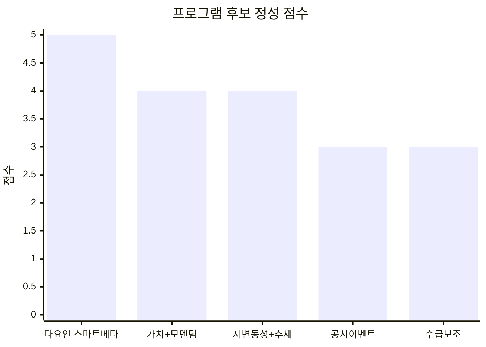
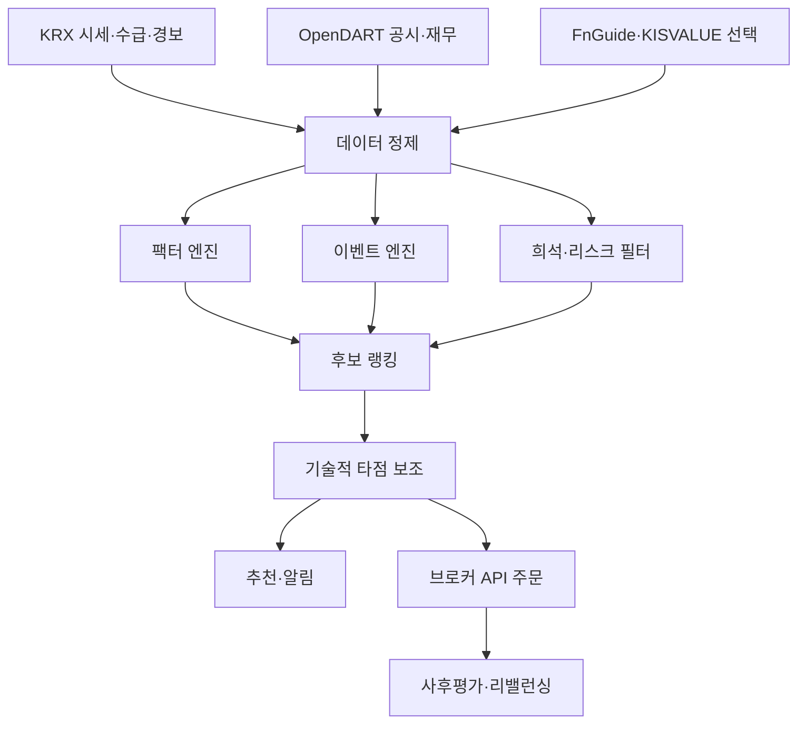
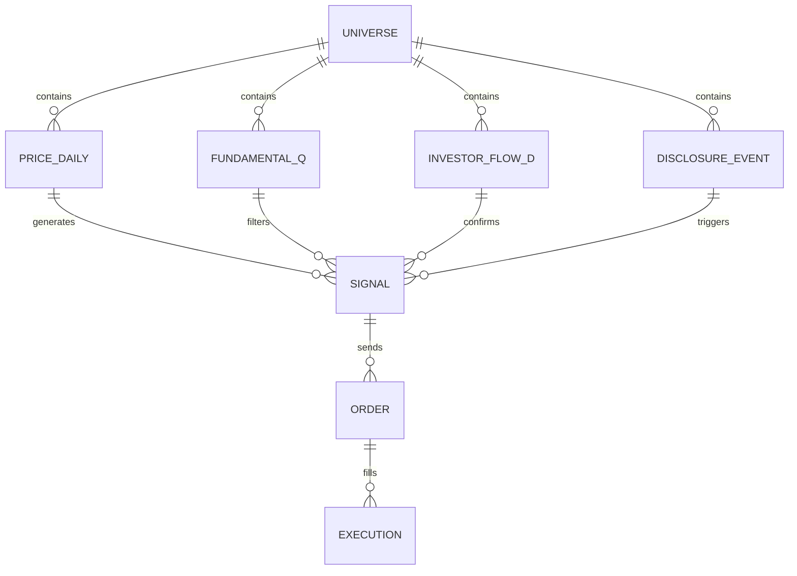

# 국내 주식 투자기법의 실증성 및 프로그램화 가능성 심층조사

## 요약

이번 조사의 결론은 단순합니다. 국내 주식시장에서 널리 회자되는 “전문가 기법” 가운데, **국내 실증근거가 상대적으로 강하고 프로그램화 가치가 높은 축은 펀더멘털·퀀트 계열과 일부 이벤트·수급 보조 계열**입니다. 반대로 **분봉 단타, 스캘핑, 테마주 순환매, VI·상한가 후속파동, 뉴스 속도전**처럼 체결·속도·해석 우위가 핵심인 기법은 일반 개인에게 구조적으로 불리하고, 검증보다 성공담이 앞서는 경우가 많았습니다. 국내 연구에서는 개인투자자의 과도한 거래와 저조한 성과, 군집거래와 복권형 주식 선호가 반복적으로 확인되며, 2020년 코로나19 국면에서 개인투자자의 연 환산 거래회전율은 1,600%에 달했고 시장수익률을 하회한 것으로 보고되었습니다. citeturn22view0

국내 실증연구를 우선순위대로 정리하면, **저변동성·저위험**, **가치+모멘텀 결합**, **수익성·투자·비유동성 결합 다요인 전략**, **배당 전략**, **소형주 프리미엄**은 상대적으로 근거가 있습니다. 다만 모멘텀 단독은 연구기간과 유동성 환경에 따라 결과가 상충합니다. 2011년 연구는 전반적으로 역행전략이 우세하다고 보았지만, 2018년 연구는 2000년 이후 유동성 개선과 함께 모멘텀 효과가 강해졌다고 보았고, 2015년과 2023년 연구는 가치와 결합된 모멘텀 또는 다요인 결합의 성과를 더 긍정적으로 평가했습니다. citeturn23view3turn24view4turn24view5turn23view4turn24view1

프로그램화 관점에서 가장 현실적인 방향은 **완전 자동매매보다 추천 프로그램 + 매매보조 프로그램**입니다. 이유는 국내 공개·상용 데이터 인프라가 이 방향에 더 잘 맞기 때문입니다. KRX Data Marketplace는 주식 시세, 투자자별 거래실적, 프로그램매매, VI 발동, 시장경보, 자사주·공매도 통계를 구조화해 제공하고, OpenDART는 공시원문과 주요 재무정보를 API로 제공합니다. 반면 초단타형 전략에 필요한 장중 호가·체결우위·뉴스속도 우위는 브로커 API와 실시간 인프라가 있어도, 실제 체결 경쟁과 슬리피지에서 개인이 지속 우위를 얻기 어렵습니다. citeturn21view3turn15view14turn16view2turn16view4

이번 조사 기준으로, **가장 괜찮은 전략의 형태는 “펀더멘털 다요인 랭킹 + 리스크/희석 이벤트 필터 + 일봉 차트 타점 보조”**입니다. 구체적으로는 수익성·투자·가치·모멘텀·저변동성 중 3~4개를 결합해 후보군을 만들고, 자사주 매입·수주/계약·실적 서프라이즈는 가산점, CB/BW·유상증자 같은 희석 이벤트는 감점 또는 제외한 뒤, 일봉 기준 20일/60일 추세와 거래량 조건으로 진입 시점을 잡는 방식이 가장 재현성과 자동화 적합성이 높다고 판단됩니다. 이는 국내 다요인·저위험·가치/모멘텀 결합 연구와 공시 이벤트 연구를 함께 반영한 **합리적 추론**입니다. citeturn24view1turn25view0turn15view5turn23view9turn15view6turn37view0

## 조사 범위와 방법론

조사 범위는 사용자가 업로드한 요건서의 A~F 범주를 그대로 따랐습니다. 즉, **A 단기 가격·차트 14개, B 수급·거래대금 10개, C 재료·이벤트 7개, D 펀더멘털·퀀트 12개, E 중장기·산업성장 7개, F 복합형 6개로 총 56개 기법**을 모두 포함했습니다. 별도 미지정 항목은 없습니다. fileciteturn0file0

근거 우선순위는 다음과 같이 두었습니다. 첫째, 국내 학술논문과 한국거래소·금융감독원·자본시장연구원 등 공식·준공식 자료입니다. 둘째, 공식 데이터 접근성과 API 문서입니다. 셋째, 공개 백테스트·조건검색 사례입니다. 넷째, 책·유튜브·강의 등 실전 주장은 오직 “주장 사례”로만 취급했습니다. 국내 적용성이 불명확한 해외 고전 논문은 직접 상위근거로 쓰지 않고, 국내 데이터로 재검증한 논문이 있을 때만 반영했습니다. citeturn24view1turn25view0turn22view0turn15view14

이번 보고서의 등급 기준은 다음과 같습니다. **A등급**은 국내 데이터 기반 실증과 규칙화·백테스트 가능성이 모두 높은 경우, **B등급**은 근거가 있으나 시장국면·유동성·비용의 조건부인 경우, **C등급**은 실전 경험칙으로는 의미가 있으나 핵심전략으로 채택하기엔 검증이 약한 경우, **D등급**은 주장 대비 실증이 매우 부족한 경우, **E등급**은 평균적인 개인투자자에게 오히려 구조적으로 불리할 가능성이 큰 경우입니다. 이 등급은 논문 결과 자체가 아니라, **국내 적합성·비용·재현성·자동화 용이성까지 합산한 종합판정**입니다. citeturn24view1turn25view0turn22view0

프로그램화 데이터 인프라는 비교적 명확합니다. KRX Data Marketplace는 주식 종목시세, 투자자별 거래실적, 프로그램매매, 외국인 보유량, 변동성완화장치 발동종목, 단기과열종목, 시장경보, 공매도, 자사주 공시일 전후 등락률까지 폭넓게 제공합니다. OpenDART는 공시원문, 주요 재무계정, 주요사항보고서를 API로 제공합니다. 상용 데이터로는 FnGuide DataGuide와 KISVALUE가 재무·주가·가치지표를 정제된 형태로 제공합니다. 주문 인프라는 한국투자증권 Open API와 키움 REST API가 대표적이며, 한국투자는 REST와 WebSocket, 키움은 주문·시세·조건검색·투자자별 매매 서비스를 공식적으로 안내합니다. citeturn21view3turn15view14turn17search2turn17search5turn16view2turn16view4

| 데이터 소스 | 제공 내용 | 접근성 | 프로그램 용도 |
|---|---|---|---|
| KRX Data Marketplace | 시세, 투자자별 거래, 프로그램매매, VI, 시장경보, 공매도, 자사주 관련 통계 | 공개 통계 + 회원기반 서비스 | 백테스트, 경보·수급·이벤트 엔진 citeturn21view3turn9search2 |
| OpenDART | 공시원문, 주요 재무계정, 주요사항보고서 | 무료 API 키 기반 | 공시 파서, 이벤트 필터, 재무 팩터 citeturn15view14turn9search6 |
| FnGuide DataGuide | 재무·주가·컨센서스·다운로드 템플릿 | 유료 | 팩터 모델, 정제 재무데이터 적재 citeturn17search2turn17search5 |
| KISVALUE | 기업·주가·가치평가 지표 | 유료 | 가치·재무안정성 팩터, 데이터 검증 citeturn17search4turn17search16 |
| KIS Developers | 국내주식 API, REST, WebSocket, 샘플코드 | 계좌·신청 필요 | 추천/자동주문, 실시간 시세 수신 citeturn16view2 |
| 키움 REST API | 주문, 시세, 조건검색, 투자자별 매매 | 계좌·신청 필요 | 조건식 기반 알림, 주문 연동 citeturn16view4turn10search11 |

## 전체 지형도와 핵심질문

국내 투자기법 전체 지형을 실증성과 자동화 적합도로 정리하면, **차트형은 일부 일봉 추세형만 보조지표 가치가 있고**, **수급형은 일봉 기준 외국인·기관 데이터가 가장 쓸 만하며**, **이벤트형은 공시 기반만 상대적으로 유효**, **퀀트형은 가장 우수**, **중장기 내러티브형은 정량화 전엔 막연**, **복합형은 펀더멘털 필터 후 기술적 진입이 가장 실용적**이라는 구조가 드러납니다. citeturn15view2turn15view9turn15view5turn24view1turn25view0

| 분류 | 대표 기법군 | 국내 실증강도 | 자동화 적합도 | 핵심 판정 |
|---|---|---|---|---|
| 단기 가격·차트 | 돌파, 신고가, 이동평균, 갭, 시초가 | 약~중 | 중 | 이동평균·52주 고가 계열만 부분 근거가 있고, 패턴형·단타형은 비용과 거짓신호에 취약합니다. citeturn15view2turn23view0turn22view0 |
| 수급·거래대금 | 외국인/기관, 거래대금, 주도주, VI | 약~중 | 중 | 일봉 수급은 정보가 있지만 테마·급등·VI·주도주 추격은 평균적 개인에게 불리합니다. citeturn15view9turn15view10turn29view1 |
| 재료·이벤트 | 실적, 공시, 자사주, 무증, 뉴스 | 중 | 중 | 공시 기반 이벤트는 연구가 있으나 반응이 매우 빨라 “속도전”보다 필터형이 더 낫습니다. citeturn15view5turn23view9turn15view6 |
| 펀더멘털·퀀트 | 가치, 퀄리티, 저변동성, 모멘텀, 배당 | 중~강 | 높음 | 국내에서 가장 실증적이고, 규칙화·리밸런싱·백테스트가 쉽습니다. citeturn24view1turn25view0turn15view1turn23view5 |
| 중장기·성장 | 성장산업, 산업사이클, 턴어라운드 | 약~중 | 중 | 아이디어 자체는 유효하지만, 대부분 내러티브를 수치화해야 프로그램화가 가능합니다. citeturn19search2turn31search4 |
| 복합형 | 펀더멘털+기술적, 차트+수급+재료 | 중 | 중~높음 | 정량 필터를 중심으로 복합화할수록 실용성이 올라갑니다. citeturn24view1turn15view2turn15view9 |

핵심질문에 대한 답은 다음과 같습니다. **Q1. 단순 경험칙에 가까운 기법**은 눌림목, 장대양봉 후 조정, 캔들 패턴, 주도주 눌림목, VI 활용, 급등주 후속파동, 뉴스 속도전입니다. 이들에는 명확한 국내 비용차감 성과 근거가 부족하고, 대개 차트 예시와 생존자 사례가 중심입니다. citeturn6search1turn29view1turn22view0

**Q2. 국내 실증근거가 상대적으로 강한 전략**은 저변동성·저위험, 가치+모멘텀 결합, 수익성·투자·비유동성 다요인, 배당, 일부 소형주 프리미엄입니다. 다만 모멘텀 단독은 연구결과가 갈리므로 “단독 A등급”으로 볼 수 없고, 가치·품질·유동성 필터와 결합할 때 훨씬 낫습니다. citeturn25view0turn24view1turn15view1turn23view5turn23view3turn24view4turn23view4

**Q3. 개인투자자가 선호하는 단타·급등주·테마주 기법의 기대수익**은 평균적으로 높다고 보기 어렵습니다. 개인은 과도하게 거래하고, 시장수익률을 하회하며, 복권형 주식 선호와 군집거래가 강합니다. 2016년 상반기 테마주는 지수 대비 4~6배 급등했지만 이후 큰 폭으로 하락했고, 개인 비중은 평균 94.6%였습니다. 무상증자 테마화 현상 역시 공시 직후와 권리락일에 가격·회전율이 급등하지만 의미 있는 주주환원 효과는 관찰되지 않았습니다. citeturn22view0turn29view1turn28search10

**Q4. 국내 시장구조가 유리하거나 불리하게 만드는 기법**도 뚜렷합니다. 국내 주식의 일일 가격제한폭은 ±30%이고, VI는 2분 단일가 냉각장치로 동적·정적으로 구분됩니다. 가격제한폭은 가격발견을 지연시킬 수 있고, 상·하한가나 VI 근처에서 생기는 “후속파동”은 실제론 제도 왜곡과 낮은 유동성의 결과일 수 있습니다. 코스닥에서는 테마주의 급등락과 희석성 공시의 사전 정보유출 문제가 더 강하게 관측됩니다. citeturn35search11turn12search3turn12search1turn23view8turn37view0turn29view1

**Q5. 프로그램화 관점에서 가장 현실적인 것**은 추천 프로그램과 매매보조 프로그램입니다. 완전 자동매매도 가능하지만, 국내 개인이 안정적으로 구현하기 쉬운 것은 월·주 단위 다요인 리밸런싱이나 일봉 조건형 전략이지, 분봉 스캘핑이 아닙니다. 공식 데이터와 브로커 API는 충분하지만, 초단타 우위는 데이터 접근이 아니라 체결 경쟁과 행동통제에 의해 좌우됩니다. citeturn21view3turn15view14turn16view2turn16view4turn22view0

## 기법별 심층분석

아래 표는 사용자가 요구한 8개 항목을 압축해 **기법명 / 실제 규칙·데이터 / 전문가 주장 논리 / 실증·현실검증·리스크 / 지표·자동화·등급**의 동일 포맷으로 정리한 것입니다. 지표는 문헌에 명시된 경우만 적었고, 아니면 **확인 불가**로 표기했습니다. 자동화 표기는 **구현난이도 / 자동화 적합도(1~5) / 검증우선순위** 순서입니다. fileciteturn0file0

**A. 단기 가격·차트 기반 기법**

| 기법명 | 실제 규칙·데이터 | 전문가 주장 논리 | 실증·현실검증·리스크 | 지표·자동화·등급 |
|---|---|---|---|---|
| 돌파매매 | 종목=최근 n일 고점·박스상단 근접+거래량 증가; 매수=종가 돌파; 매도=돌파 실패·이평 이탈; 손절=3~5%; 보유=1~10일; 데이터=OHLCV | 신규 수급 유입이 추세를 연장 | 이동평균·52주 고가 계열엔 일부 근거가 있으나 일반 돌파 전반의 국내 비용차감 근거는 제한적입니다. 거짓돌파와 손실 집중이 핵심 리스크입니다. citeturn15view2turn23view0 | 지표 확인 불가 / 중/3/중 / C |
| 눌림목 매매 | 종목=상승추세 종목; 매수=5/20일선 또는 직전 돌파선 재지지; 매도=추세선 이탈; 보유=2~10일 | 추세 중 일시적 조정은 재상승 기회 | 국내 직접논문은 약하고, 이동평균/단기반전 연구를 간접 근거로만 쓸 수 있습니다. 규칙이 느슨해 사후해석 위험이 큽니다. citeturn15view2turn15view11 | 지표 확인 불가 / 중/3/중 / C |
| 장대양봉 이후 조정 매매 | 종목=급등 직후; 매수=양봉 몸통 1/3~1/2 조정; 매도=전고점 실패; 보유=1~5일 | 강한 매수세가 다시 유입 | 과열 후 반전·심리적 가격장벽 연구는 있지만, 이 패턴 자체의 독립 알파는 약합니다. 급등주의 유동성 공백이 큽니다. citeturn15view11turn22view0 | 확인 불가 / 중/2/낮음 / D |
| 신고가 돌파 매매 | 종목=52주 신고가 근접; 매수=신고가 돌파; 매도=재하락·종가 이탈; 보유=수일~수주 | 앵커 상향과 추세추종 | 52주 고가 접근이 미래 누적수익률을 예측한다는 국내 연구가 있어 차트형 중 근거가 가장 낫습니다. 다만 장중 추격보다 종가 기준 규칙화가 더 적합합니다. citeturn23view0 | 확인 불가 / 낮음~중/4/높음 / B |
| 전고점 돌파 매매 | 종목=직전 고점 근접; 매수=전고점 상향 돌파; 매도=돌파 실패; 보유=1~10일 | 매물대 해소 후 가속 | 52주 고가보다는 근거가 약하지만 앵커 효과와 연관 지을 수 있습니다. 구간 정의에 따라 과최적화 가능성이 큽니다. citeturn23view0turn15view11 | 확인 불가 / 중/3/중 / C |
| 시초가 매매 | 종목=전일 뉴스·공시·갭 발생; 매수=시초가 또는 초기 5~15분 범위 돌파; 매도=당일 청산 | 밤사이 정보가 시가에 반영되기 전·직후 대응 | 국내 이벤트 연구는 정보가 시가에 빠르게 반영되고 장중 상당 부분 소멸될 수 있음을 보입니다. 속도·체결우위가 핵심이라 개인에게 불리합니다. citeturn28search2turn23view9 | 확인 불가 / 높음/2/낮음 / D |
| 종가베팅 | 종목=당일 강세·호재 또는 실적/공시 기대; 매수=종가 부근; 매도=익일 시초~수일 | 정보 미반영분을 익일 반영 기대 | 일부 실적드리프트 연구는 있지만 “종가베팅 일반론”의 직접 근거는 약합니다. 이벤트 선별 실패 시 갭리스크가 큽니다. citeturn15view5turn23view9 | 확인 불가 / 낮음/3/중 / D |
| 갭상승·갭하락 대응 | 종목=시초 갭 발생 종목; 매수·매도=갭 메움 또는 갭 지속 규칙; 보유=당일~수일 | 과잉반응 또는 정보반영 지속 | 국내 연구는 갭 방향 예측과 시가 반영 현상은 다루지만, 실전 비용차감 우월성을 강하게 뒷받침하지는 않습니다. citeturn6search1turn28search2 | 확인 불가 / 중/2/낮음 / D |
| 이동평균선 정배열·역배열 | 종목=5>20>60 또는 반대; 매수=정배열+가격 상향; 매도=배열 훼손 | 추세 방향의 간명한 필터 | 이동평균 전략의 초과수익과 마켓타이밍 가능성을 국내 연구가 일부 보여줍니다. 다만 후행성이 커 횡보장에 약합니다. citeturn15view2turn6search7 | 확인 불가 / 낮음/4/높음 / B |
| 5일선, 20일선, 60일선 기법 | 매수=단기선 상향/중기선 지지; 매도=선 이탈; 보유=수일~수주 | 평균회귀보다 추세지속 활용 | 이동평균 계열과 같은 근거군입니다. 기간 선택에 따라 성과 차이가 커서 고정 규칙 백테스트가 필수입니다. citeturn15view2turn6search7 | 확인 불가 / 낮음/4/높음 / B |
| 거래량 급증 이후 추세 추종 | 종목=거래량 평균 대비 2~5배; 매수=양봉 동반 급증; 매도=거래량 둔화·추세 이탈 | 정보 유입의 흔적은 거래량 | 직접 국내 실증은 제한적입니다. 특히 급등주에서는 거래량 급증이 정보보다 투기 수요일 수 있어 테마화 위험이 큽니다. citeturn29view1turn22view0 | 확인 불가 / 중/3/중 / C |
| 캔들 패턴 기반 매매 | 장악형·망치형 등 패턴 인식; 매수·매도=패턴 발생 즉시 | 집단심리가 봉에 압축 | 캔들 이미지를 이용한 예측 연구는 있으나, 패턴 자체가 안정적 투자알파라는 의미는 아닙니다. 해석 주관성이 큽니다. citeturn6search1turn6search9 | 확인 불가 / 중/2/낮음 / D |
| 박스권 돌파 매매 | 종목=횡보 n일; 매수=상단 돌파; 매도=하단 복귀; 손절=돌파폭의 일부 | 축적 뒤 방향성 분출 | 이동평균·신고가 논리와 유사한 보조전략으로는 가능하나, 박스 정의가 임의적이라 과최적화 위험이 큽니다. citeturn15view2turn23view0 | 확인 불가 / 중/3/중 / C |
| 분봉 단타, 스캘핑, 데이트레이딩 | 1~5분봉, 체결강도, 호가잔량, 뉴스; 당일 청산 | 미세한 속도 우위로 반복 수익 | 과도한 거래가 개인 성과를 악화시킨다는 국내 근거가 강합니다. 브로커 실시간 인프라는 있어도 체결·슬리피지·정신적 소모를 감안하면 평균 개인에게 가장 불리한 축입니다. citeturn22view0turn16view2turn16view4 | 확인 불가 / 높음/1/낮음 / E |

**B. 수급·거래대금·시장주도주 기반 기법**

| 기법명 | 실제 규칙·데이터 | 전문가 주장 논리 | 실증·현실검증·리스크 | 지표·자동화·등급 |
|---|---|---|---|---|
| 거래대금 상위주 매매 | 종목=일·분 거래대금 상위; 매수=강한 추세 동반; 보유=당일~수일 | 돈이 몰리는 곳이 주도주 | 거래대금 자체는 유동성·관심도의 지표이지만 독립 알파 근거는 약합니다. 테마 장세에선 개인 군집거래와 결합될 위험이 큽니다. citeturn22view0turn29view1 | 확인 불가 / 낮음/3/중 / C |
| 당일 주도주·대장주 매매 | 종목=테마 내 선도 종목; 매수=상승 탄력 상위; 매도=첫 약세 | 시장의 가장 강한 종목이 끝까지 간다 | 공식·학술 근거보다 실전 담론이 앞섭니다. 사후적으로 “대장”을 규정하기 쉬워 재현성이 낮습니다. citeturn29view1turn22view0 | 확인 불가 / 중/2/낮음 / D |
| 테마주 순환매 추적 | 종목=정치·정책·산업 테마; 매수=초기 확산; 매도=테마 약화 | 자금이 테마 간 순환 | 국내 테마주 연구와 자료는 급등 후 급락, 개인 비중 집중을 보여줍니다. 평균적 개인에게 구조적으로 위험합니다. citeturn28search0turn29view1turn28search10 | 확인 불가 / 중/1/낮음 / E |
| 외국인·기관 순매수 추종 | 종목=외인·기관 순매수 지속; 매수=연속 순매수+추세; 매도=순매도 전환 | 정보우위 주체가 먼저 산다 | 국내 연구에서 외국인·기관 또는 특정 기관 매수강도 증가 후 주가상승이 관찰됩니다. 다만 효력은 시장·기간·투자자군에 따라 다릅니다. citeturn15view9turn15view10 | 확인 불가 / 낮음/4/높음 / B |
| 프로그램 매매 수급 추종 | 종목=프로그램 순매수 유입; 매수=동조 방향 | 파생-현물 연계 자금이 방향성 제시 | KRX가 프로그램매매 데이터를 제공하지만, 이를 이용한 현대 국내 알파 증거는 강하지 않습니다. 파생·차익거래 구조 이해가 필요합니다. citeturn21view3 | 확인 불가 / 중/3/중 / C |
| 연속 순매수 종목 추적 | 종목=3~10일 연속 외인/기관 순매수; 매수=가격 추세 확인 후 | 지속 매집은 정보 누적 | 투자주체별 예측력이 존재한다는 연구와 잘 맞는 보조 규칙입니다. 다만 뒤늦은 추종이 되기 쉬워 가격 필터가 필요합니다. citeturn15view9turn15view10 | 확인 불가 / 낮음/4/높음 / B |
| 장중 체결강도·호가잔량 활용 | 종목=실시간 체결강도, 매도/매수잔량; 매수=미세 불균형 | 호가 미세구조가 단기 방향을 시사 | 구현은 가능하지만 초단타형이라 속도·체결 경쟁이 핵심입니다. 우선순위 자료에서 지속가능 알파 근거는 확인하기 어렵습니다. citeturn16view2turn16view4 | 확인 불가 / 높음/2/낮음 / D |
| 상한가 다음 날 매매 | 종목=전일 상한가; 매수=시초 강세·눌림목; 매도=장중 약화 | 가격발견 지연과 후속 수급 | 가격제한폭 제도는 가격발견을 지연시킬 수 있지만, 왜곡된 체결과 갭리스크도 큽니다. 재현성은 낮습니다. citeturn23view8turn35search11 | 확인 불가 / 중/3/중 / C |
| VI 발동 종목 활용 | 종목=동적/정적 VI 발동; 매수=해제 후 추세 확인 | 냉각 뒤 방향성 재확인 | VI는 변동성 완화장치이지 알파 신호가 아닙니다. 급변·오류 주문·수급 불균형 상황에서도 발동되므로 후행성 경계가 필요합니다. citeturn12search3turn12search1 | 확인 불가 / 중/2/낮음 / D |
| 급등주 후속파동 매매 | 종목=단기 급등 후 2·3차 파동 기대 | 군중심리와 FOMO 활용 | 국내 개인의 군집거래·복권형 주식 선호, 테마주의 급등락 통계가 이 전략의 구조적 위험을 보여줍니다. 성공담보다 평균 손실 가능성이 큽니다. citeturn22view0turn29view1 | 확인 불가 / 중/1/낮음 / E |

**C. 재료·이벤트 기반 기법**

| 기법명 | 실제 규칙·데이터 | 전문가 주장 논리 | 실증·현실검증·리스크 | 지표·자동화·등급 |
|---|---|---|---|---|
| 실적 발표 전후 매매 | 종목=실적 발표·서프라이즈 후보; 매수=발표 직후 또는 서프라이즈 선반영; 매도=드리프트 소멸 | 이익정보는 즉시 다 반영되지 않는다 | 국내 PEAD 연구가 존재합니다. 다만 진짜 핵심은 “실적 발표”가 아니라 “예상치 대비 surprise”이므로 컨센서스 데이터와 룩어헤드 방지가 중요합니다. citeturn15view5 | 지표 확인 불가 / 중/4/높음 / B |
| 수주·계약 공시 매매 | 종목=단일판매·공급계약 공시; 매수=공시 직후 필터 충족 시; 매도=익일~수일 | 계약은 미래 매출을 보장 | 공급계약 공시는 당일 주가를 유의하게 올리지만, 다음 날 반전이 나타날 수 있습니다. 수주잔고 정보는 미래이익 예측력이 있으나 시장이 과대평가할 수 있습니다. citeturn23view9turn23view10 | 확인 불가 / 낮음~중/4/높음 / B |
| 정책 수혜주 매매 | 종목=정책 발표 수혜 예상군; 매수=초기 기대감; 매도=정책 확정 또는 관심 둔화 | 정책 기대가 선반영 | 정치·정책 테마주는 이벤트 연구와 테마주 통계가 있지만, 지속알파보다 기대감 급등락의 성격이 강합니다. 판단의 주관성이 큽니다. citeturn28search0turn29view1 | 확인 불가 / 중/2/낮음 / D |
| 산업 이슈·테마 발생 초기 매매 | 종목=신규 산업 뉴스, 수혜 ETF/섹터; 매수=이슈 초기 확산 | 정보 초기 확산이 가장 크다 | 코로나19 테마형 ETF 연구는 정보가 비거래시간에 시가로 반영되고 장중 소멸될 수 있음을 보여줍니다. 초기라는 규정 자체가 불명확합니다. citeturn28search2turn29view1 | 확인 불가 / 중/2/낮음 / D |
| M&A·자사주 매입·무상증자·액면분할 이벤트 매매 | 종목=해당 공시 발생; 매수=이사회/공시 직후; 매도=단기 행사 후 | 기업행동은 가치신호 | 자사주 매입 공시는 긍정적 반응이 확인되고, 액면분할·무상증자도 공시·상장일 단기 양(+) 반응이 관찰됩니다. 다만 무상증자는 테마화·착시효과 위험이 커 하위 필터가 필요합니다. M&A 단독 국내 직접지표는 이번 우선자료 범위에서 확인이 제한적이었습니다. citeturn15view6turn15view7turn15view8turn28search3turn28search10 | 자사주·액분·무증 단기 CAR 존재, 연수익률은 확인 불가 / 중/4/높음 / B |
| 임상·FDA·기술수출 등 바이오 이벤트 매매 | 종목=임상결과·허가·기술수출 뉴스; 매수=헤드라인 즉시 | 정보 비대칭이 크고 반응이 강하다 | 우선순위 국내 자료에서 이 이벤트군의 일반화 가능한 투자규칙 근거는 제한적이었습니다. 확인된 제약바이오 연구는 특정 팬데믹 국면 성과 분석 수준이어서 규칙 일반화에 부족합니다. citeturn27search0turn28search2 | 확인 불가 / 높음/2/낮음 / D |
| 뉴스 속도전 매매 | 종목=속보 종목; 매수=헤드라인 파싱 즉시 | 가장 먼저 아는 사람이 돈을 번다 | 국내 이벤트 연구는 정보가 빠르게 흡수되고, 일부는 시가 반영 후 장중 소멸된다고 봅니다. 이는 개인이 가장 불리한 전장입니다. citeturn23view9turn28search2 | 확인 불가 / 높음/1/낮음 / E |

**D. 펀더멘털·퀀트 기반 기법**

| 기법명 | 실제 규칙·데이터 | 전문가 주장 논리 | 실증·현실검증·리스크 | 지표·자동화·등급 |
|---|---|---|---|---|
| 저PER, 저PBR, 고ROE | 분기·연간 재무로 하위 PER/PBR, 상위 ROE 선별; 월·분기 리밸런싱 | 싸고 수익성 높은 기업은 재평가 | 국내 다요인 연구와 재무정보 연구가 이를 핵심 팩터로 다룹니다. 다만 단순 저PBR만으로는 가치함정 리스크가 있어 수익성 결합이 바람직합니다. citeturn24view1turn31search4 | 확인 불가 / 낮음/5/높음 / B |
| 영업이익 증가율, 매출 성장률 기반 | 전년동기 대비 매출·영익 증가 상위 선별; 실적 둔화 시 제외 | 실적 개선은 주가로 이어진다 | 국내 재무정보 연구는 성장성과 수익성 정보가 주가에 반영됨을 보여줍니다. 다만 성장만으로는 주주가치 설명력이 약할 수 있습니다. citeturn31search4turn31search2 | 확인 불가 / 낮음/4/높음 / B |
| 이익 모멘텀 | EPS/영업익 surprise, 상향추정, 연속 개선; 보유=수주~수개월 | 이익 수정은 천천히 반영 | PEAD와 미래이익 정보효과 연구가 간접 근거입니다. 컨센서스 데이터가 필요하고 이벤트 시차 처리에 주의해야 합니다. citeturn15view5turn19search5 | 확인 불가 / 중/4/높음 / B |
| 가치주 전략 | 저밸류 종목군 편입, 정기 리밸런싱 | 저평가가 평균회귀 | 가치 단독은 국내에서 유효하지만 시장국면 의존성이 있습니다. 모멘텀과 결합할 때 안정성이 높아집니다. citeturn23view4turn24view1 | 확인 불가 / 낮음/4/높음 / B |
| 퀄리티 전략 | 수익성, 현금흐름, 재무건전성, 발생액, F-score 등 상위군 | 좋은 기업은 비싸도 오래 강하다 | 국내 8요인 연구에 퀄리티가 포함되며, 회계정보 기반 최적화 연구도 있습니다. 다만 퀄리티 단독보다 가치·모멘텀과의 결합이 더 실용적입니다. citeturn24view1turn31search7turn32search6 | 확인 불가 / 낮음/4/높음 / B |
| 저변동성 전략 | 역사적 변동성·베타·고유변동성 하위군 선별; 월간 리밸런싱 | 덜 위험한 주식이 더 낫다 | 2024년 국내 연구는 저위험 이상현상이 유의하며, 특히 고유변동성과 관련되고 ETF 개선안 31개도 성과 향상을 보였다고 보고합니다. 다만 위험측도와 기간에 따라 결과가 달라집니다. citeturn25view0turn25view2turn23view6 | 확인 불가 / 낮음/5/높음 / A |
| 모멘텀 팩터 전략 | 6~12개월 승자 매수/패자 회피, 월간 리밸런싱 | 강한 것이 계속 강하다 | 국내 모멘텀은 상충합니다. 전기간에서는 역행이 우세하다는 연구가 있고, 2000년 이후·유동성 보정후·가치결합하에서는 모멘텀이 유효합니다. 단독 채택보다 결합형이 낫습니다. citeturn23view3turn24view4turn24view5turn23view4 | 확인 불가 / 낮음/4/높음 / B |
| 가치 + 모멘텀 결합 전략 | 가치 상위군 중 최근 승자만 편입, 정기 리밸런싱 | 밸류에이션과 추세를 함께 보면 함정을 줄인다 | 국내 연구는 가치와 모멘텀이 역상관 관계에 있어 결합 시 유의미한 양(+) 절편을 보인다고 보고합니다. 실무적으로도 가장 설득력 있는 축입니다. citeturn23view4turn24view1 | 확인 불가 / 낮음/5/높음 / A |
| 재무안정성 기반 종목 선별 | 부채비율, 유동비율, 이자보상배율, 자본잠식 제외 | 망가질 가능성이 낮은 기업 선호 | 회계정보 기반 포트폴리오 연구가 유효성을 보입니다. 단독 전략보다 가치·퀄리티 필터로 쓰는 편이 합리적입니다. citeturn31search7turn31search4 | 확인 불가 / 낮음/4/높음 / B |
| 배당주 전략 | 배당수익률 상위, 9~2월 보유 등 계절형 또는 연간형 | 배당락 전 수요와 방어성 | 국내 연구에서 9월말~다음 해 2월말 고배당주의 평균 누적초과수익률은 9.64%였습니다. 다만 연도별 편차가 커 방어주 성격과 경기국면 고려가 필요합니다. citeturn15view1 | 5개월 평균 누적초과 9.64% / 낮음/4/높음 / B |
| 소형주 프리미엄 | 시총 하위군 편입, 유동성 필터, 정기 리밸런싱 | 작은 기업은 더 높은 보상 | 2024년 연구는 2000~2023년 규모효과가 유의하다고 봅니다. 다만 개인 순매수와 벤처정책 영향도 컸고, 실제 구현은 유동성·충격비용에 민감합니다. citeturn23view5 | 확인 불가 / 낮음/4/높음 / B |
| 리밸런싱 포트폴리오 전략 | 월간·분기 정기 재구성, 동일가중 또는 위험조정 | 규율 있는 재평가와 분산 | 다요인·회계정보·저위험 전략 대부분은 리밸런싱을 전제로 성과가 나옵니다. 다만 리밸런싱은 “전략”이라기보다 엔진이므로 신호 품질이 더 중요합니다. citeturn24view1turn31search7 | 확인 불가 / 낮음/5/높음 / B |

**E. 중장기 추세·산업 성장 기반 기법**

| 기법명 | 실제 규칙·데이터 | 전문가 주장 논리 | 실증·현실검증·리스크 | 지표·자동화·등급 |
|---|---|---|---|---|
| 성장산업 선점 | 산업 분류·시장규모·CAPEX·정책·수출 데이터 기반 후보 선정 | 큰 산업 물결이 개별 종목을 밀어준다 | 아이디어는 타당하지만, “선점”의 정의가 주관적입니다. 산업지표를 계량화하지 않으면 전문가 담론과 다르지 않습니다. citeturn19search2turn24view1 | 확인 불가 / 중/3/중 / C |
| 구조적 성장주 장기보유 | 고ROE·매출성장·시장지배력·낮은 부채의 장기 복합조건 | 좋은 기업은 오래 우상향 | 퀄리티·수익성 연구와 상응하지만, 밸류에이션 과열 시 장기성과가 흔들립니다. 장기보유는 전략보다 종목평가 역량의 문제입니다. citeturn24view1turn31search2 | 확인 불가 / 중/3/중 / C |
| 산업 사이클 투자 | 재고·금리·수출·업황지표로 업종 비중 조절 | 업황 전환 전 선제 대응 | 경기변동과 수익률의 인과관계 연구는 있으나, 종목 수준 실전 규칙으로 옮기면 시차·거짓신호가 큽니다. citeturn19search2 | 확인 불가 / 중/3/중 / C |
| 반도체·방산·전력기기·AI·바이오 등 특정 섹터 추세 추종 | 섹터 ETF/업종 대표주 추세선·거래대금·실적 체크 | 섹터 강세가 개별주를 이끈다 | 특정 시기엔 강하지만 테마화되기 쉽습니다. 코로나 국면 연구도 정보가 즉시 반영되고 장중 소멸될 수 있음을 보여줍니다. citeturn28search2turn29view1 | 확인 불가 / 중/3/중 / C |
| 실적 턴어라운드 매매 | 적자축소→흑전, 영업이익률 개선, 컨센서스 상향 | 변화의 초기에 사면 크다 | 실적정보의 정보효과와 드리프트를 감안하면 중장기형 중 비교적 낫습니다. 다만 일회성 흑전·회계효과를 걸러야 합니다. citeturn15view5turn31search4 | 확인 불가 / 중/4/높음 / B |
| 매출·수익성 개선 초기 기업 발굴 | YoY 매출·마진 개선, CAPEX 대비 효율, 수주잔고 반영 | 펀더멘털 변화의 초기 포착 | 수주잔고와 미래이익 예측력, 성장·수익성 정보효과와 연결됩니다. 추천엔진에는 적합하나 완전자동 매매로는 보완이 필요합니다. citeturn23view10turn31search4 | 확인 불가 / 중/4/높음 / B |
| 시장 점유율 확대 기업 추적 | 산업 데이터·공시·사업보고서 텍스트로 점유율 추정 | 경쟁우위 확대가 장기 주가를 만든다 | 좋은 내러티브지만 점유율 데이터가 분절적이고 정형화가 어렵습니다. 현 단계에선 리포트용 보조지표에 가깝습니다. citeturn15view14turn17search2 | 확인 불가 / 높음/2/낮음 / C |

**F. 복합형·실전 고수형 기법**

| 기법명 | 실제 규칙·데이터 | 전문가 주장 논리 | 실증·현실검증·리스크 | 지표·자동화·등급 |
|---|---|---|---|---|
| 차트 + 수급 + 재료 결합 | 차트 추세 + 외인/기관 + 공시/뉴스를 동시에 확인 | 한 변수의 오판을 다른 변수로 보완 | 방향은 맞지만, 보통 전문가들은 규칙을 모호하게 설명합니다. 정량화에 성공하면 의미가 있으나, 설명형으로 남으면 C등급입니다. citeturn15view9turn23view9turn15view2 | 확인 불가 / 중/3/중 / C |
| 주도주 눌림목 | 당일 강한 종목의 조정 구간 재진입 | 가장 강한 종목의 재가속 | 실전 담론에 비해 국내 직접 검증은 약하고, 사실상 “주도주 추격+짧은 반등 기대”에 가깝습니다. citeturn29view1turn22view0 | 확인 불가 / 중/2/낮음 / D |
| 거래대금 상위주 중 재료 확인 후 진입 | 거래대금 상위 후 공시·뉴스·테마 확인; 진입=강세 유지 | 관심·유동성·재료를 동시 확보 | 테마 군집을 어느 정도 걸러낼 수 있으나, 결국 속도·해석 문제를 안고 있습니다. 알림형 보조전략으로 적합합니다. citeturn23view9turn29view1 | 확인 불가 / 중/3/중 / C |
| 중장기 유망주를 단기 차트 타점으로 진입 | 펀더멘털 좋고 장기후보인 종목 위에 돌파·지지 타점 | 좋은 기업을 더 좋은 가격에 산다 | 실무적으로 설득력이 높고, 퀄리티/가치와 기술적 규칙을 결합할 수 있습니다. 추천+매매보조에 특히 적합합니다. citeturn24view1turn15view2 | 확인 불가 / 중/4/높음 / B |
| 펀더멘털 필터 후 기술적 매수 | 가치·수익성·저위험 필터 후 MA/신고가/거래량 진입 | 질 좋은 후보군에서 차트는 타점만 본다 | 국내 다요인 연구와 이동평균·신고가 계열 연구를 결합한 형태로, 이번 조사에서 가장 실용적입니다. 이는 실증결과를 종합한 추론입니다. citeturn24view1turn25view0turn15view2turn23view0 | 확인 불가 / 중/5/높음 / A |
| 계좌분할·손절·익절 규칙 포함 매매 시스템 | 포지션 사이징, 최대손실, 이익실현, 재진입 금지 규칙 포함 | 알파보다 생존이 중요 | 이는 알파 원천이 아니라 손실통제 장치입니다. 개인투자자 행태 편의를 줄이는 데 중요하며 자동화에 매우 유리합니다. citeturn22view0 | 확인 불가 / 낮음/4/높음 / B |

아래 표는 사용자가 요청한 **투자기법 비교 종합표**입니다. 56개 전부를 다시 세부적으로 반복하지 않고, 전략 채택 판단에 필요한 핵심 축만 뽑아 요약했습니다.

| 기법명 | 분류 | 주된 논리 | 국내 실증 근거 | 현실 성공 가능성 | 주요 리스크 | 자동화 적합도 | 최종 등급 |
|---|---|---|---|---|---|---|---|
| 신고가 돌파 | 차트 | 앵커 상향·추세 지속 | 부분 있음 | 중 | 거짓돌파 | 4 | B |
| 이동평균 계열 | 차트 | 추세 필터 | 부분 있음 | 중 | 횡보장 손실 | 4 | B |
| 눌림목·장대양봉·캔들 | 차트 | 심리·패턴 | 약함 | 낮음 | 사후해석 | 2~3 | C~D |
| 외인·기관 순매수 추종 | 수급 | 정보우위 주체 추종 | 있음 | 중 | 지연추격 | 4 | B |
| 거래대금·주도주·VI | 수급 | 관심·유동성 | 약함 | 낮음 | 군집·후행성 | 2~3 | C~D |
| 테마주 순환매·급등파동 | 수급/테마 | 군중심리 | 위험통계는 강함 | 낮음 | 급락·희석 | 1 | E |
| 실적발표 전후 | 이벤트 | PEAD | 있음 | 중 | 컨센서스 필요 | 4 | B |
| 수주·계약 공시 | 이벤트 | 미래매출 반영 | 있음 | 중 | 다음날 반전 | 4 | B |
| 자사주·무증·액분 이벤트 | 이벤트 | 기업행동 신호 | 있음 | 중 | 테마화·착시 | 4 | B |
| 뉴스 속도전·바이오 속보 | 이벤트 | 정보 선점 | 약함 | 낮음 | 속도 경쟁 | 1~2 | D~E |
| 저PER/PBR/고ROE | 퀀트 | 저평가+수익성 | 있음 | 중~높음 | 가치함정 | 5 | B |
| 저변동성 | 퀀트 | 저위험 이상현상 | 강함 | 높음 | 국면 의존 | 5 | A |
| 가치+모멘텀 결합 | 퀀트 | 밸류+추세 상호보완 | 강함 | 높음 | 리밸런싱 필요 | 5 | A |
| 배당·소형주 | 퀀트 | 계절성·규모효과 | 있음 | 중 | 유동성 | 4 | B |
| 성장산업·섹터장기보유 | 중장기 | 큰 내러티브 | 제한적 | 중 | 과도한 스토리 의존 | 3 | C |
| 펀더멘털 필터 후 기술적 매수 | 복합 | 후보군 품질+타점 | 가장 실용적 | 높음 | 룩어헤드 관리 | 5 | A |

## 전문가 성공담 신뢰성 검증과 단타·급등주 평가

국내 주식 “전문가 성공담”의 가장 큰 문제는 **검증 단위가 전략이 아니라 사례**라는 점입니다. 차트 몇 장, 수익 스크린샷, 특정 구간의 계좌곡선은 거의 언제든 만들 수 있지만, 그 자체로는 **거래비용·세금·슬리피지·실패 거래·출금/입금·포지션 사이즈**를 알 수 없습니다. 국내 개인투자자 연구가 보여주는 것은 정반대입니다. 거래빈도가 높을수록 성과가 나빠지고, 복권형 주식 선호와 군집거래가 강할수록 성과가 저조합니다. 따라서 “단기 고수”의 성공담은 평균 투자자의 기대성과를 대변하지 못합니다. citeturn22view0

단타·급등주 기법이 인기가 있는 이유는 분명합니다. 변동성이 크고 짧은 시간에 큰 돈을 벌었다는 서사가 강렬하기 때문입니다. 그러나 국내 자료는 테마주가 지수보다 훨씬 큰 폭으로 급등한 뒤 더 큰 폭으로 하락하고, 그 과정의 손실 부담이 개인에게 집중된다는 점을 보여줍니다. 2016년 상반기 테마주는 코스피·코스닥 지수 상승률을 크게 웃돌았지만, 최고점 이후 하락률도 훨씬 컸고 개인 비중은 94.6%였습니다. 무상증자 테마화 현상 역시 공시 후와 권리락일에 급등·고회전율이 나타났지만 의미 있는 주주환원 효과로 연결되지는 않았습니다. citeturn29view1turn28search10

국내 시장구조도 이 환상을 강화합니다. 일일 가격제한폭 ±30%, VI 2분 단일가, 단기과열·시장경보 제도는 가격발견을 끊어 놓을 수 있고, 이 때문에 상한가 다음 날·VI 후 재상승·급등주 후속파동 같은 패턴이 있는 것처럼 보일 수 있습니다. 하지만 가격제한폭 연구는 이런 제도가 가격발견을 지연시키고 변동성 회복을 늦출 수 있다고 봤고, VI 역시 “주가 급변 시 냉각시간을 부여하는 장치”이지 방향성 보장 장치가 아닙니다. 즉, 단타 고수들이 말하는 “패턴” 중 상당수는 시장의 본질적 비효율이라기보다 **제도·유동성·심리 왜곡의 부산물**일 수 있습니다. citeturn23view8turn23view7turn12search3turn12search1

그렇다고 차트나 단기 신호가 전부 허상이라는 뜻은 아닙니다. 현실적으로 남는 요소는 세 가지입니다. 첫째, **일봉 기준 추세 필터**로서의 이동평균·52주 고가. 둘째, **일봉 기준 수급 필터**로서의 외인·기관 연속 순매수. 셋째, **공시형 이벤트 필터**로서의 실적·공급계약·자사주 매입. 이 세 가지는 서로 결합될 때 의미가 커집니다. 반대로 스캘핑·뉴스속도전·테마 순환매는 엄격히 배제하는 편이 합리적입니다. citeturn15view2turn23view0turn15view9turn15view5turn23view9turn15view6

## 프로그램화 후보 Top5와 권장 MVP

이번 조사 기준으로 가장 먼저 구현할 가치가 있는 후보는 아래 다섯 가지입니다. 공통점은 **규칙 정의가 가능하고, 데이터 확보가 가능하며, 국내 실증근거가 상대적으로 강하거나 적어도 구조적으로 불리하지 않다**는 점입니다. 반대로 스캘핑·VI·상한가 다음 날·뉴스 속도전은 연구 목적의 관찰 대상이지, 1차 제품 후보로는 부적절합니다. citeturn24view1turn25view0turn21view3turn15view14

| 후보 전략 | 전략 개요 | 추천 이유 | 필요한 데이터 | 구현 난이도 | 적합 형태 | 백테스트 우선순위 |
|---|---|---|---|---|---|---|
| 다요인 스마트베타 추천엔진 | 가치·수익성·투자·모멘텀·저변동성 중 3~4개 결합 후 월간 랭킹·리밸런싱 | 국내 8요인·저위험 연구와 가장 잘 맞고 자동화가 쉽습니다. citeturn24view1turn25view0 | 재무제표, 시가총액, 수익률, 변동성, 거래대금 | 중간 | 추천 / 준자동 | 최우선 |
| 가치+모멘텀 스윙 | 저평가 종목군 중 최근 강한 종목만 선별, 주간·월간 리밸런싱 | 국내에서 결합형의 설득력이 높습니다. citeturn23view4turn24view1 | 밸류 지표, 6~12개월 수익률, 유동성 | 낮음~중간 | 추천 / 자동매매 가능 | 최우선 |
| 저변동성 + 추세 필터 | 저변동성·저고유변동성 군에서 MA·신고가 조건 충족 시 진입 | 방어적이면서도 타점 개선이 가능합니다. citeturn25view0turn15view2turn23view0 | 변동성, 베타, OHLCV | 낮음~중간 | 추천 / 자동매매 가능 | 높음 |
| 공시 이벤트 알림 엔진 | 실적·수주·자사주·무증·액분 긍정이벤트 감지, CB/BW·유증은 경고 | 속도전보다 “분류와 회피”에 강합니다. citeturn15view5turn23view9turn15view6turn37view0 | OpenDART, KRX 이벤트 통계, NLP 파서 | 중간 | 알림 / 추천 | 높음 |
| 외인·기관 수급 보조전략 | 외인·기관 연속 순매수 + 일봉 추세 + 유동성 필터 | 일봉 보조전략으로는 실용적입니다. citeturn15view9turn15view10 | 투자자별 거래실적, OHLCV, 거래대금 | 낮음 | 알림 / 추천 / 준자동 | 중간 |

이 다섯 후보를 프로그램 형태로 나누면, **추천 프로그램**에는 다요인 랭킹과 이벤트 알림이 가장 적합하고, **매매 보조 프로그램**에는 외인·기관 수급과 일봉 차트 타점 결합이 적합합니다. **완전 자동매매**는 가치+모멘텀과 저변동성+추세처럼 주문 시점이 일봉 혹은 장 종료 후로 내려오는 전략에서만 상대적으로 현실적입니다. 이는 공식 데이터와 브로커 API의 구조가 일봉·리밸런싱형에 더 우호적이기 때문입니다. citeturn16view2turn16view4turn21view3

정성 점수로 비교한 프로그램 후보는 아래와 같습니다. 이 점수는 앞선 실증문헌과 구현요건을 종합한 **평가 점수**입니다. citeturn24view1turn25view0turn15view5

권장 MVP는 다음 구조가 가장 현실적입니다. KRX·DART·상용데이터를 결합해 후보군을 만들고, 기술적 필터는 “신호 생성”이 아니라 “진입 시점 보조”로만 쓰는 구조가 좋습니다. citeturn21view3turn15view14turn17search2turn16view2

데이터 모델은 지나치게 복잡할 필요가 없습니다. 핵심은 **일봉 시세**, **분기 재무**, **투자자별 수급**, **공시 이벤트**, **신호**, **주문/체결**의 다섯 축입니다. citeturn21view3turn15view14turn16view2turn16view4

## 최종 결론

이번 조사에서 **국내 주식 투자기법 중 가장 현실적인 것은 “다요인 펀더멘털 전략을 중심으로 하고, 기술적 지표는 진입 보조로만 쓰는 방식”**이었습니다. 단일 기법으로는 저변동성 또는 가치+모멘텀이 가장 낫지만, 실제 제품으로 구현할 때는 **수익성·투자·가치·모멘텀·저변동성 중 일부를 결합한 다요인 추천엔진**이 더 우수합니다. 여기에 **실적/공급계약/자사주 매입 가점**, **CB/BW·유상증자 감점**, **외인·기관 순매수와 일봉 추세 조건을 보조로 얹는 구조**가 국내 시장에 가장 잘 맞습니다. 이는 국내 다요인·저위험·이벤트·수급 연구를 종합한 결론입니다. citeturn24view1turn25view0turn15view5turn23view9turn15view6turn15view9turn37view0

반대로 **개인투자자가 가장 많이 속기 쉬운 기법**은 테마주 순환매, 급등주 후속파동, VI·상한가 다음 날 추격, 뉴스속도전, 스캘핑입니다. 이 기법들은 실제로 전혀 돈이 안 된다고 단언할 수는 없지만, 평균적 개인에게 필요한 속도 우위·심리 통제·체결 경쟁력·손실 통계 공개가 결여되어 있어, “전략의 우월성”보다 “성공자의 생존”이 더 큰 설명변수일 가능성이 높습니다. citeturn22view0turn29view1turn12search3turn23view8

따라서 **바이브코딩으로 구현할 1차 MVP 전략**은 완전 자동매매가 아니라,  
**“국내주식 다요인 추천 + 공시 이벤트 필터 + 일봉 기술적 진입 알림”**이 가장 적절합니다.  
권장 MVP 기능은 다음과 같습니다.  
첫째, KRX·DART 기반 종목 유니버스와 결측치 정제.  
둘째, 가치·수익성·모멘텀·저변동성 랭킹 계산.  
셋째, 자사주·수주·실적 서프라이즈 가점과 유상증자·CB/BW 감점.  
넷째, 20일/60일 이동평균·52주 고가·거래량 조건을 활용한 매매보조 알림.  
다섯째, 사후 성과추적과 리밸런싱 로그입니다.  
이 방향은 데이터 접근성, 실증성, 유지보수성의 균형이 가장 좋습니다. citeturn21view3turn15view14turn16view2turn24view1turn25view0turn23view0

마지막으로, **완전 자동매매보다 종목추천 + 매매보조가 더 현실적**이라는 판단을 분명히 적어 두겠습니다. 국내 브로커 API가 주문 자동화는 지원하지만, 초단타 전략의 핵심 병목은 API 유무가 아니라 시장 미세구조와 체결경쟁입니다. 반면 추천·알림형은 국내 연구에서 상대적으로 설득력 있는 팩터와 이벤트를 거의 그대로 제품화할 수 있습니다. 즉, 첫 제품은 “누가 더 빨리 사느냐”보다 **“무엇을 제외하고 무엇을 우선순위로 볼 것인가”를 잘 정하는 문제**로 설계하는 편이 훨씬 합리적입니다. citeturn16view2turn16view4turn22view0turn24view1turn25view0